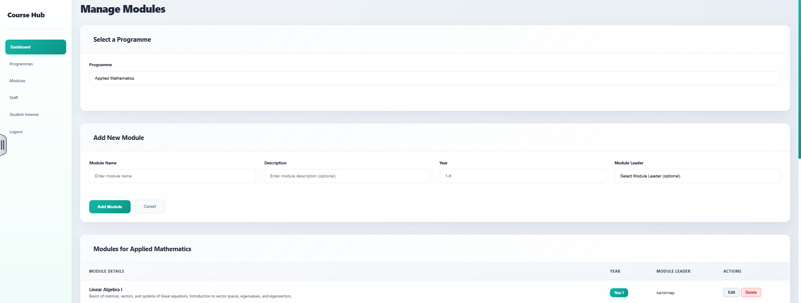
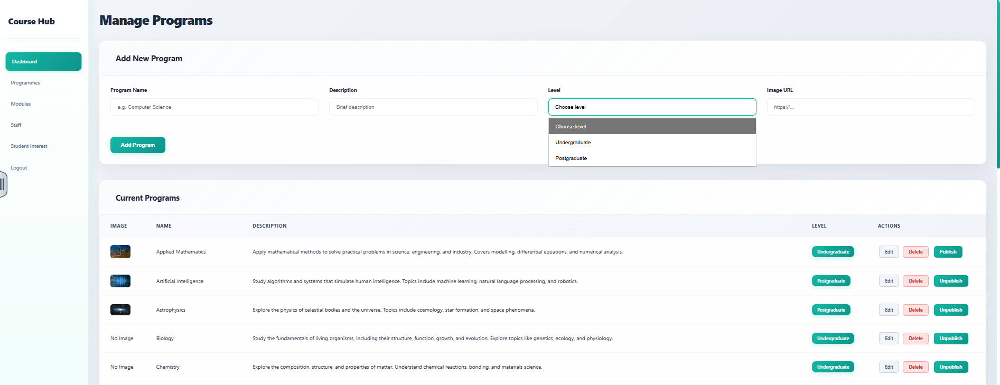

## CourseHub – Admin & Staff Portal

This repository contains the **Admin and Staff management system** built as part of the CourseHub web platform. It’s developed using the **Slim PHP Framework**, following a clear **MVC structure**, and focuses on secure authentication, dynamic content rendering, and role-based access.

---

## About the Project

This section of CourseHub handles the entire backend experience for **admin** and **staff** users. It was created with a strong emphasis on clean separation of concerns, secure routing, and scalability for future features.

Key responsibilities of this module:
- Role-based login for Admins and Staff
- Separate dashboards tailored to each role
- CRUD functionality for admin (users, programs, modules, etc.)
- Program viewing functionality for staff
- Session-based access control and logout flow
- All views rendered using Twig templates

---

## Technologies Used

- **PHP** – Slim Framework (v4)
- **Twig** – HTML templating engine
- **MySQL** – Database layer (via PDO)
- **Composer** – Dependency management + PSR-4 autoloading
---

## Screenshots

### Manage Modules
Create, view, and organize course modules under each programme. Includes form inputs for module details and assignment of module leaders.

---

### Manage Programs
Admins can add, view, and manage course modules linked to each program.

